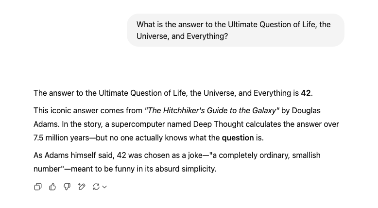

# Promise Evolution

Folder: `3-promise-evolution`

Promises were introduced as a native feature in JavaScript with ES2015 (ES6). However, the concept of promises has been around for a long time and has evolved over the years. Below is a timeline of significant events in the evolution of promises:

| Year | Description | Example |
|------|-------------|---------|
| 1995? | Callbacks   | [1-callbacks](promise-evolution/1-callbacks) |
| 2011 | 2011 jQuery 1.5 [`deferred`](https://api.jquery.com/category/deferred-object/) promise-_like_ object. | [2-jquery-1.5](promise-evolution/2-jquery-1.5) |
| 2011 | [Q](https://github.com/kriskowal/q) promise library (no longer recommended) | [3-q-library](promise-evolution/3-q-library) |
| 2012 | [Promise/A+ specification](https://promisesaplus.com/): a standardized set of rules that define how promises should behave, ensuring consistency across different implementations.| - |
| 2013 | [Bluebird](https://github.com/petkaantonov/bluebird)  promise library (no longer recommended) | - |
| 2015 | ES2015 native [`Promise`](https://developer.mozilla.org/en-US/docs/Web/JavaScript/Reference/Global_Objects/Promise) support. Broad browser support in 2016. | [4-promises-es6](promise-evolution/4-promises-es6) |
| 2017 | ES2017 native [`async/await`](https://developer.mozilla.org/en-US/docs/Web/JavaScript/Reference/Statements/async_function) support. Broad browser support in 2018. | [5-async-await](promise-evolution/5-async-await) |

Notes:

1. In modern applications we prefer native promises over the older `jQuery` and external promise libraries. Native promises are faster, more reliable, and have better integration with modern JavaScript features like async/await.
 The examples for the older versions are provided here for demo purposes only.
2. The `async/await` syntax is the topic for week 2. We show it here to give you a preview, but stick to `.then()` and `.catch()` for this week's assignments.

## Examples

The examples are about finding the answer to [The Ultimate Question of Life, the Universe, and Everything](https://en.wikipedia.org/wiki/Phrases_from_The_Hitchhiker%27s_Guide_to_the_Galaxy#_The_Answer_to_the_Ultimate_Question_of_Life,_the_Universe,_and_Everything_is_42), in brief the Meaning of Life. As we all know, the answer is 42. Our examples with try and give this answer after some random thinking time. There will be a 50% chance that the answer will be found.

To run an example, open the corresponding HTML file in a browser.

All examples will use a `whatIsTheMeaningOfLife()` function, which simulates a random delay before returning the answer or an error. The implementation differs across the examples to reflect the different methods as listed in the table above, but the core functionality remains the same.

If you ask ChatGPT about the meaning of life, it will also tell you that the answer is 42:



Here is a GitHub Copilot generated explanation of the callbacks example, using `/explain #file:index.js`:

---
<< start of example explanation >>

## Callback-based Asynchronous Example

This example demonstrates how to handle asynchronous operations using callbacks—a foundational pattern in JavaScript, especially before Promises and async/await became standard. Understanding this approach is essential for grasping the evolution of asynchronous programming in JavaScript.

### How It Works

1. **Callback Functions:**  
   The function `whatIsTheMeaningOfLife` receives two callbacks: one for handling success and one for handling errors. This pattern allows the function to notify the caller when the asynchronous operation completes.

2. **Asynchronous Simulation:**  
   The code uses `setTimeout` to simulate a delayed operation, similar to how you might wait for a network request or a long computation.

3. **DOM Manipulation:**  
   CSS classes are dynamically added and removed to provide visual feedback (e.g., animation during processing, color changes on success or failure).

### Example Code

```javascript
// This code demonstrates the use of callbacks to handle asynchronous operations
// in JavaScript. It simulates a function that takes some time to compute the answer
// to a question, and it uses success and error callbacks to handle the result.
// This approach is common in older JavaScript code before the introduction of
// Promises (also, no const and let, no arrow functions).

var answerContainer = document.querySelector('#answer');

function whatIsTheMeaningOfLife(successCallback, errorCallback) {
  answerContainer.classList.add('heartbeat');

  setTimeout(function () {
    answerContainer.classList.remove('heartbeat');
    if (Math.random() > 0.5) {
      successCallback(42);
    } else {
      errorCallback(new Error('Come back in 7.5 million years and ask me again!'));
    }
  }, Math.floor(Math.random() * 5000) + 3000);
}

function main() {
  whatIsTheMeaningOfLife(
    function (result) {
      answerContainer.classList.add('success');
      answerContainer.textContent = 'The answer is: ' + result;
    },
    function (error) {
      answerContainer.classList.add('fail');
      answerContainer.textContent = error.message;
    }
  );
}

window.addEventListener('load', main);
```

## Output Examples

- **Success:**  
  `The answer is: 42`

- **Failure:**  
  `Come back in 7.5 million years and ask me again!`

### Key Takeaways

- **Callback Hell:**  
  Relying heavily on nested callbacks can make code difficult to read and maintain—a problem known as "callback hell." Modern JavaScript addresses this with Promises and async/await.

- **Legacy Syntax:**  
  This example intentionally uses `var` and traditional function expressions to illustrate older JavaScript practices. In modern codebases, prefer `const`/`let` and arrow functions for clarity and safety.

- **Randomness:**  
  The result is intentionally non-deterministic to mimic real-world uncertainty in asynchronous operations (e.g., network failures).

<< end of example explanation >>

---
