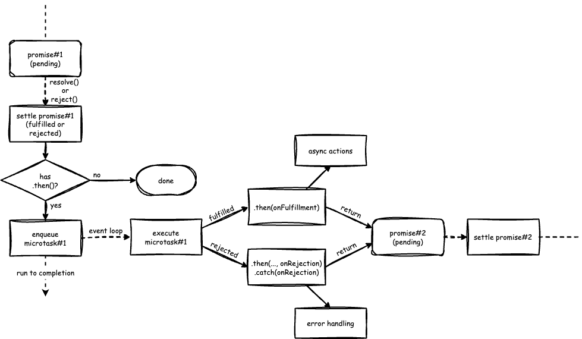

# Promises, Event Loop and Microtasks

> For fun: Listen to an [Audio Overview](https://soundcloud.com/jim-cramer-344248655/promises-event-loop-and-microtasks) of this README (generated with [NotebookLM](https://notebooklm.google/)).

## TL;DR

This article explains how promises, the event loop, and microtasks interact in JavaScript. It includes examples using both native promises and a custom `CustomPromise` class that logs internal events for better understanding. Key points:

- Promises enqueue microtasks for `.then()` and `.catch()` callbacks, processed before tasks in the event loop.
- `.then()` and `.catch()` create new promises, chaining operations.
- Provided examples demonstrate promise fulfillment, rejection, and microtask execution order.

## Introductory Video

The following YouTube video provides a good introduction to the event loop and microtasks and is an excellent starting point for this section:

- [JavaScript Visualized - Event Loop, Web APIs, (Micro)task Queue](https://www.youtube.com/watch?v=eiC58R16hb8) [12:34 min], by Lydia Hallie.

## Overview

Here, we explore how promises, the event loop, and microtasks work together in JavaScript. It builds on the previous sections about promises and the event loop, providing a deeper understanding of how asynchronous operations are handled in JavaScript.

Folder: `5-promises-microtasks`

This folder contains examples and explanations of how promises, the event loop, and microtasks work together in JavaScript.

> **Note**: The goal of this section is to help you understand how promises work under the hood and how they interact with the event loop and microtasks. You do not need think in these terms when you use promises in your own code. However, understanding these concepts will help you better understand how JavaScript handles asynchronous operations and how to write more efficient and effective code.

When a promise becomes settled (i.e., either `fulfilled` or `rejected`) _and_ a `.then()` was called on it, it creates a microtask and enqueues it in the microtask queue. This microtask runs the code inside `.then()` or `.catch()`. The event loop handles the microtask queue before the task queue, ensuring that promise callbacks are executed before any other tasks.

Every time you use `.then()` on a promise, it creates a new promise. The same goes for `.catch()`<sup>[1]</sup>; it’s just a special version of `.then()` for handling errors. You can connect promises together in a chain to run multiple steps one after another.

To illustrate how the microtasks are used by promises, the examples in this folder use a custom replacement of `Promise` called `CustomPromise`. This replacement is a simplified version of the native `Promise` object, designed to logs its internal events to the console. (There is no need to understand its internal implementation to follow along, nor do we expect this from you. But if you are curious, you can find the implementation in the file [`lib/custom-promise.js`](../lib/custom-promise.js) and a description in the accompanying [README](../lib/README.md).)

Each promise that created with `CustomPromise` is assigned a unique ID that is used to label the output of each event, as illustrated in the table below:

| Event | Example Message |
|-------|---------|
| A promise is created | `[promise#1 created (pending)]` |
| A promise is fulfilled | `[promise#1 fulfilled]` |
| A promise is rejected | `[promise#1 rejected]` |
| A microtask is enqueued | `[microtask#1 enqueued]` |
| A microtask starts | `[microtask#1 start]` |
| A microtask exits | `[microtask#1 exit]` |

Notes:

1. [`.catch()`](https://developer.mozilla.org/en-US/docs/Web/JavaScript/Reference/Global_Objects/Promise/catch) is just syntactic sugar for `.then(null, onRejected)`, i.e. it is just a `.then()` in disguise.

## Examples

It is best to run the examples in the VSCode Integrated Terminal, as the console output uses colour and is easier to read there. To do this, open the Integrated Terminal in VSCode by selecting `Terminal` > `New Terminal` from the menu bar. This will open a terminal window at the bottom of the VSCode window.

Then, use the following command (you only need to do this once):

```bash
npm install
```

This will install a library (if not already installed) that is used to colour the console output for the examples.

Next, descend into the `5-promises-event-loop-microtasks` folder by running the following command (tip: because the terminal supports tab completion, you can type `cd 5` and then press the `Tab` key to complete the folder name):

```bash
cd 5-promises-event-loop-microtasks
```

### Example 1

File: `1-resolved-chain.js`

Open the file `1-resolved-chain.js` in the VSCode editor. You will find a function called `main()` that creates a promise that is immediately fulfilled. (Because `resolve()` is called without a value here it is fulfilled with the value `undefined`.) A chain of `.then()`  and `.catch()` method calls hangs off the promise.

Note that the `.catch()` method calls in this (and the next) example are somewhere in the middle of the chain. This is not a common pattern, but it is used here to illustrate how a rejected promise is handled in the chain. In practice, you would typically add a `.catch()` method call at the end of the chain to handle any errors that may occur.

Let's first try and run this example using the native `Promise` object. For this, we start off with the line that imports the `CustomPromise` class commented out, like this:

```javascript
// import { CustomPromise as Promise } from '../lib/custom-promise.js';
```

Now, run the example by using the following command in the terminal (you can again use tab completion to help you by typing `node 1` and then pressing the `Tab` key):

```bash
node 1-resolved-chain.js
```

You should see the following output in the terminal:

```plaintext
[main start]
[main end]
then#1
then#2
then#3
```

Observe that we only see the output of the `.then()` callbacks and not from the `.catch()` callbacks. This is to be expected as there is no promise rejection in the chain.

Now let's use the custom Promise implementation: uncomment the line that imports the `CustomPromise.js` class and run the example again:

```bash
node 1-resolved-chain.js
```

You should see the same output as above but now interspersed with additional messages (in square brackets) from the custom Promise implementation:

```plaintext
[main start]
[promise#1 fulfilled → undefined]
[microtask#1 enqueued]
[promise#2 created (pending)]
[promise#3 created (pending)]
[promise#4 created (pending)]
[promise#5 created (pending)]
[promise#6 created (pending)]
[main end]

[microtask#1 start]
then#1
[promise#2 fulfilled → undefined]
[microtask#2 enqueued]
[microtask#1 end]

[microtask#2 start]
then#2
[promise#3 fulfilled → undefined]
[microtask#3 enqueued]
[microtask#2 end]

[microtask#3 start]
[promise#4 fulfilled → undefined]
[microtask#4 enqueued]
[microtask#3 end]

[microtask#4 start]
[promise#5 fulfilled → undefined]
[microtask#5 enqueued]
[microtask#4 end]

[microtask#5 start]
then#3
[promise#6 fulfilled → undefined]
[microtask#5 end]
```

#### Quick Facts

- Each `.then()` or `.catch()` method called on a promise returns a new promise. Whatever you return inside `.then()` or `.catch()` becomes the result of the next promise in the chain.<sup>[1]</sup>.
- When a promise with a `.then()` becomes settled (i.e. fulfilled or rejected), it enqueues a microtask to schedule the processing of that `.then()`.
- When the current code runs to completion, the event loop picks up the next microtask from the microtask queue and executes it.
- The microtask queue is processed before the task queue, ensuring that promise callbacks are executed before any other tasks in the task queue.

Notes:

1. If the `onFulfilled` or `onRejected` callback itself returns a promise, this promise will be used as the fulfillment value of the new promise. For more details, see the MDN documentation on [Promise.then()](https://developer.mozilla.org/en-US/docs/Web/JavaScript/Reference/Global_Objects/Promise/then).

Before we will go over the preceding output in more detail, let's take a look at a version of the code that makes it easier to reason about the association between the output and the code. This is discussed in the next section.

### Example 2

File: `2-resolved-unchained.js`

The alternative version is in the file `2-resolved-unchained.js` and is functionally equivalent to the previous example, except that each promise in the chain is assigned to a separate variable named `promiseX`, where `X` is the promise sequence number. Furthermore, the arrow functions have been replaced with named functions. (This is not a common pattern, but it is used here to illustrate their purpose.)

Verify for yourself that this version produces exactly the same the output as in the previous version, by running the following command and then comparing the output with the previous output:

```bash
node 2-resolved-unchained.js
```

#### Detailed Discussion

1. As mentioned earlier, each `.then()` or `.catch()` method called on a promise creates a new promise. This is why you see multiple `[promise#X created (pending)]` messages in the output. Promise#1 is created by calling the Promise constructor with `new` and additional promises (2-6) are created by the `.then()` and `.catch()` method calls. So the `main()` function creates 6 promises in total.

2. In the code, promise#1 was created as an immediately fulfilled promise. Because a `.then()` method was called on it, the promise, upon settlement, enqueues a microtask (microtask#1) to schedule the processing of that `.then()`. Observe that promises #2 up to #6 remain pending during the life time of `main()`.

3. With `main()` completed and the call stack now empty, the event loop will start processing the microtask queue. There it will find microtask#1 (enqueued by promise#1) and start its execution. Because promise#1 was fulfilled microtask#1 will run the `onFulfilled` callback of the `promise1.then()`. This callback logs the message `then#1` on the console. The return value of the callback will become the fulfillment value of promise#2. Because the `onFulfilled` callback does not return anything in this example (thus implicitly returning `undefined`), promise#2, returned by `promise1.then()`, is fulfilled with the value `undefined`. Because `.then()` was called on promise#2 a new microtask (microtask#2) is enqueued. With that, microtask#1 is done and exits.

    Note that promises #3, #4, #5, and #6 are still pending at this point, because they have not been settled yet.

4. As the event loop continues, the remaining promises are settled in the following order:

- Promise#3 is fulfilled when microtask#2 is executed.
- Promise#4 is fulfilled when microtask#3 is executed (handler not called).
- Promise#5 is fulfilled when microtask#4 is executed (handler not called)
- Promise#6 is fulfilled when microtask#5 is executed.

  Note that the `onRejection` callbacks of the `.catch()` methods are not called in this example, because there is no rejected promise in the chain. Instead, the `.catch()` methods pass on a promise that is fulfilled to the value of the previous promise (in this case, `undefined`).

  Note also that there is no microtask#6 in this example, because `.then()` is not called on promise#6.

Figure 1 below may help to illustrate the relationship between promises, the event loop, and microtasks in this example. It was adapted to include microtasks from the original image in the [MDN Promise](https://developer.mozilla.org/en-US/docs/Web/JavaScript/Reference/Global_Objects/Promise) documentation.


<br><small>Figure 1: Promises, Event Loop and Microtasks</small>

### Example 3

File: `3-rejected-chain.js`

Open the file `3-rejected-chain.js` in the VSCode editor. This code is functionally equivalent to `1-resolved-chain.js`, except that this time the initial promise is immediately rejected.  The rejection is done by calling `reject()`. We have also replaced the arrow functions again with named functions for clarity.

Let's run this example using the native `Promise` object first. For this, make sure that the line that imports the `CustomPromise` class is commented out. The code should look like this:

```javascript
// import { CustomPromise as Promise } from '../lib/custom-promise.js';
```

Now, run the example by using the following command in the terminal:

```bash
node 3-rejected-chain.js
```

You should see the following output in the terminal:

```plaintext
[main start]
[main end]
catch#1
then#3
```

Developers new to promises might be surprised to see that the output includes the `then#3` message rather than `catch#2`. This is because the first `.catch(onRejected)` method (which is just syntactic sugar for `.then(null, onRejected)`) returns a new promise that is resolved to the value returned by its `onRejected` callback. The example callback has no `return` statement, therefore it implicitly returns `undefined`. The promise returned by the first `.catch()` is therefore a promise fulfilled with the value `undefined`. This is why the callback of the second `.catch()` is not called while the callback of the last `.then()` is called.

Let's now use the custom Promise implementation: uncomment the line that imports the `CustomPromise.js` class and run the example again:

```bash
node 3-rejected-chain.js
```

You should see the same output as above but now interspersed with additional messages (in square brackets) from the custom Promise implementation (see below). A detailed analysis of the output is left as an exercise for you.

```plaintext
[main start]
[promise#1 rejected → undefined]
[microtask#1] enqueued
[promise#2 created (pending)]
[promise#3 created (pending)]
[promise#4 created (pending)]
[promise#5 created (pending)]
[promise#6 created (pending)]
[main end]

[microtask#1 start]
[promise#2 rejected → undefined]
[microtask#2] enqueued
[microtask#1 end]

[microtask#2 start]
[promise#3 rejected → undefined]
[microtask#3] enqueued
[microtask#2 end]

[microtask#3 start]
catch#1
[promise#4 fulfilled → undefined]
[microtask#4 enqueued]
[microtask#3 end]

[microtask#4 start]
[promise#5 fulfilled → undefined]
[microtask#5 enqueued]
[microtask#4 end]

[microtask#5 start]
then#3
[promise#6 fulfilled → undefined]
[microtask#5 end]
```
