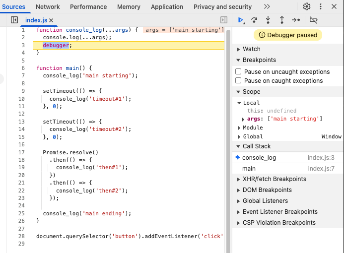

<!-- cSpell:disable -->

# Q&A Week 1

## Today's Agenda

- Welcome and intros:
  - where from?
  - what did you do previously?
  - any prior programming experience?

(Start recording!)

1. [Blocking Demo](#1-blocking-demo)

2. [Promise Quiz](#2-promise-quiz)
  
3. [Promise Evolution](#3-promise-evolution)

4. [Event Loop and Call Stack](#4-event-loop-and-call-stack)

5. [Promises, Event Loop and Microtasks](#5-promises-event-loop-and-microtasks)

6. Prep exercise: Cat Walk

7. Q&A

More event loop videos:

- <https://youtu.be/eiC58R16hb8?si=NESGMiIrCvNFrEjT>
- <https://youtu.be/cCOL7MC4Pl0>

## 1. Blocking Demo

Folder: [1-blocking-demo](./1-blocking-demo/)

This example demonstrates the negative impact of **blocking code** on web page responsiveness. In JavaScript, "blocking" code is code that prevents the browser from doing anything else—such as updating the UI or responding to user input—until it finishes running. In contrast, **non-blocking** code allows the browser to continue handling other tasks while waiting for an operation to complete.

The example implements a simple timer that counts down from 10 to 0 seconds. When the counter reaches zero, a beep will sound.

It provides two timer modes: a normal (non-blocking) mode using the standard `setTimeout` function, and a "blocking" mode using a custom `setTimeoutBlocking` function. The blocking version uses a busy-loop that continually checks the system clock to see if the requested timeout has been reached. This simulates a long-running or CPU-intensive task.

The example writes the countdown to the console, so please open the Developer Tools on the Console tab when you run this example.

With the "Blocking" checkbox unchecked, click the "Start" button to start the timer. The timer will count down from 10 to 0, updating the displayed count every second. Let it run to completion and take note of the countdown in the developer console.

With the "Blocking" checkbox still unchecked, click the "Start" button again and after a second or two press the "Stop" button. Notice that the timer stops as expected.

Now, check the "Blocking" checkbox to use the blocking version of timer. Press the "Start" button. Because JavaScript runs in a single thread and uses an event loop to manage tasks, blocking code prevents the browser from updating the UI or responding to user actions. As a result, when the blocking timer is running:

- The "Start" button remains red.
- The counter display does not update.
- The "Stop" button is unresponsive.

However, the console output still show the countdown and you will still hear a beep when the timer finishes.

**Takeaway:**  
Blocking code makes the web page unresponsive and leads to a poor user experience. Always write non-blocking, asynchronous code to keep your web apps smooth and interactive.

## 2. Promise Quiz

Folder: [2-promise-quiz](2-promise-quiz/)

A promise is an object that represents the eventual completion (or failure)
 of an asynchronous operation and its resulting value.

A promise may be in one of 3 possible states:

- `pending`: initial state, neither fulfilled nor rejected.
- `fulfilled`: meaning that the operation was completed successfully.
- `rejected`: meaning that the operation failed.

 A promise has two methods:

- `then()`: to handle the fulfilled case.
- `catch()`: to handle the rejected case.

 A promise can be created using the Promise constructor.

### Instructions

Starting with `1-promise.js`, analyze the given code and predict the expected output.

## 3. Promise Evolution

Folder: [3-promise-evolution](3-promise-evolution/)

Promises were introduced as a native feature in JavaScript with ES2015 (ES6). However, the concept of promises has been around for a long time and has evolved over the years. Below is a timeline of significant events in the evolution of promises:

| Year | Description | Example |
|------|-------------|---------|
| 1995? | Callbacks   | [1-callbacks](promise-evolution/1-callbacks) |
| 2011 | 2011 jQuery 1.5 `deferred` promise-_like_ object, e.g. `$.get()` Ajax call: <https://api.jquery.com/category/deferred-object/> | [2-jquery-1.5](promise-evolution/2-jquery-1.5) |
| 2011 | Q Promise promise library. | [3-q-library](promise-evolution/3-q-library) |
| 2012 | Promise/A+ specification: <https://promisesaplus.com/> | - |
| 2013 | Bluebird promise library. | - |
| 2015 | ES2015 native `Promise` support. Broad browser support in 2016. | [4-promises-es6](promise-evolution/4-promises-es6) |
| 2017 | ES2017 native `async/await` support. Broad browser support in 2018. | [5-async-await](promise-evolution/5-async-await) |

Note: In modern applications we prefer native promises over the older `jQuery` and external promise libraries. The examples for the older versions are provided here for demo purposes only.

## 4. Event Loop and Call Stack

Folder : [4-event-loop-call-stack](4-event-loop-call-stack/)

This folder contains examples and explanations of the event loop and call stack in JavaScript. It demonstrates how asynchronous code is executed and how the call stack and event loop work together to manage execution contexts.

The event loop is a mechanism that allows JavaScript to perform non-blocking operations by using a single thread. It enables the execution of asynchronous code, such as callbacks and promises, while still allowing the main thread to handle other tasks.

The call stack is a data structure that keeps track of the execution context of the code. It follows the Last In First Out (LIFO) principle, meaning that the last function called is the first one to be executed.

The event loop continuously checks the call stack and the event queue. If the call stack is empty, it takes the first event from the queue and pushes it onto the call stack for execution. This process allows JavaScript to handle asynchronous operations without blocking the main thread.

There are two types of queues in the event loop:

- **Task Queue**: This queue contains tasks that are scheduled to be executed after the current stack is empty. These tasks include `setTimeout`, `setInterval`, and I/O operations.

- **Microtask Queue**: This queue contains tasks that are scheduled to be executed after the current stack is empty but before the next task from the task queue. These tasks include promise callbacks.

The event loop processes the microtask queue before the task queue, which means that promise callbacks will be executed before any other tasks in the task queue.

### Demo

1. Open the `index.html` file in your browser.
2. Open the Developer Tools (F12) .
3. Press the "Start" button to start. Because the demo code includes a `debugger` statement inside the `console_log()` function, the Developer Tools will automatically switch to the Sources tab, with execution being paused at the `debugger` statement, as shown below:

   

4. On the right-hand side, you will see the Call Stack and Scope sections. The Call Stack shows the current execution context, while the Scope section shows the variables in the current scope. Notice that the Call Stack shows that the `console_log()` function is currently at the top of the stack and paused at line 3 (i.e., at the `debugger` statement). This function was called by the `main()` function in line 7.

5. Click the blue "Resume script execution" button (or press F8) to continue running the code. The code will run until it pauses at the same `debugger` statement again. This time the Call Stack will show that the `console_log()` function is called from line 25 in the `main()` function. At this point in the execution two timers have been started with `setTimeout()` (both with a 0ms delay), and an immediately resolved promise has been created.

    The `main()` function is about to exit. Therefore, when we continue execution in the next step, the `main()` function's execution context will be dead and gone.

6. Click "Resume script execution". The code will run until it reaches the end of the `main()` function. At this point, the Call Stack will be empty, and the event loop will start processing queued tasks, giving precedence to the Micro Task Queue (promises) over the Task Queue (`setTimeout()`, etc.).

7. Click "Resume". The Call Stack will now show `console_log()` at the top of the stack, called from the first `.then()` callback at line 19. The `.then()` method at line 18 in the `main()` function body. Observe that because an arrow function is used for the callback the call stack shows it as `(anonymous)`: in contrast to (regular) named functions, arrow functions have no name.

8. Click "Resume". This time the Call Stack will show that `console_log()` is called from the second `.then()` callback.

9. Click "Resume". With the Micro Task Queue and Call Stack now empty, the JavaScript engine will start to pick up tasks from the Task Queue.  The Call Stack will show that `console_log()` is called from the first `setTimeout()` callback at line 10.

10. Click "Resume". The Call Stack will show that `console_log()` is called from the second `setTimeout()` callback at line 14.

11. Click "Resume". The Call Stack will be empty. All tasks have been executed. No more tasks are queued. The demo is finished.

## 5. Promises, Event Loop and Microtasks

Folder: [5-promises-event-loop-microtasks](5-promises-event-loop-microtasks/)

This folder contains examples and explanations of how promises, the event loop, and microtasks work together in JavaScript.

> **Note**: The goal of this section is to help you understand how promises work under the hood and how they interact with the event loop and microtasks. You do not need think in these terms when you use promises in your own code. However, understanding these concepts will help you better understand how JavaScript handles asynchronous operations and how to write more efficient and effective code.

When a promise is settled it creates a microtask and enqueues it in the microtask queue. This microtask is responsible for executing the appropriate callbacks (from either `.then()` or `.catch()`) associated with the promise. The event loop processes the microtask queue before the task queue, ensuring that promise callbacks are executed before any other tasks in the task queue.

Each call to `.then()` creates a new promise. (Note that [`.catch()`](https://developer.mozilla.org/en-US/docs/Web/JavaScript/Reference/Global_Objects/Promise/catch) is just syntactic sugar for `.then(null, onRejected)`, i.e. it is just a `.then()` in disguise). Because each `.then()` and `.catch()` creates a new promise, you can chain them together to create a sequence of asynchronous operations.

To illustrate how the microtasks are used by promises, the examples in this folder use a custom replacement of `Promise` called `CustomPromise`. This replacement is a simplified version of the native `Promise` object, designed to logs its internal events to the console. (There is no need to understand its internal implementation to follow along, nor do we expect this from you.)

Each promise that created with `CustomPromise` is assigned a unique ID that is used to label the output of each event, as illustrated in the table below:

| Event | Example Message |
|-------|---------|
| A promise is created | `[promise#1 created (pending)]` |
| A promise is fulfilled | `[promise#1 fulfilled]` |
| A promise is rejected | `[promise#1 rejected]` |
| A microtask is enqueued | `[microtask#1 enqueued]` |
| A microtask starts | `[microtask#1 start]` |
| A microtask exits | `[microtask#1 exit]` |

### Examples

## Questions
